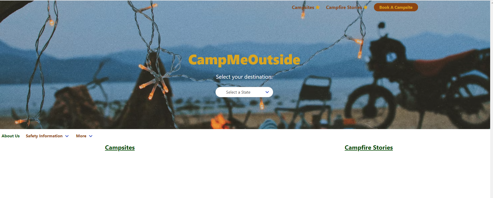
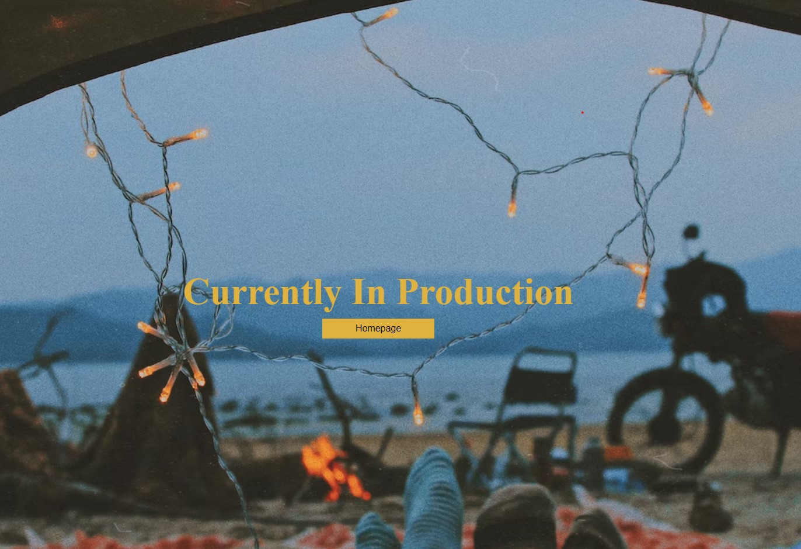
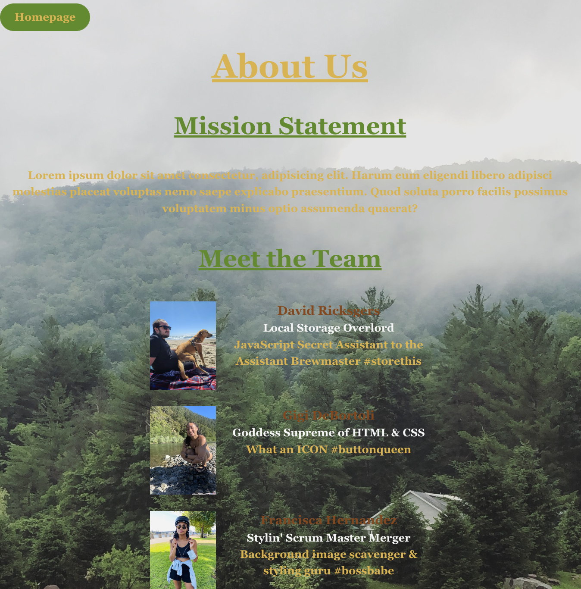

# CampMeOutside 

## Project Description

* Campsite locator and fireside story generator

## Acceptance Criteria

*  Must use at least two server side APIs that we have not used in class before
*  Must use a CSS framework other thank Bootstrap
*  Must use client-side storage for persistent data
*  Must have a polished, Mobile-first UI
*  Must meet good quality coding standards (indentation, scoping, naming, etc.)  
*  Does NOT use alerts, confirms, or prompts (look into modals)
*  Must be deployed to GitHub Pages
*  Must be interactive (i.e., accept and respond to user input)

## How to Use 

* Copy and paste the link into your browser - no need to install
 
## Built Using

* Bulma - CSS Framework
* Font Awesome - adding Icons
* Unsplash - Free Photos to use

### API's Used

* Recreation.gov API - for generating campsites
* Reddit API - Generating Scary Stories

## Assets 
Bulma
Font Awesome
Unsplash 

### Screenshot 

[Website Demo](CampMeOutside.Demo.mp4)<!-- Make sure to resize the pictures so they fit appropriately  -->

### Link to Deployed Application

https://francisca-hernandez.github.io/Camp-Me-Outside/

This site was build using [Github Pages]()

## Contributers

* Gigi DeBortoli
* Francisca Hernandez
* Joseph Hernandez
* David Ricksgers

